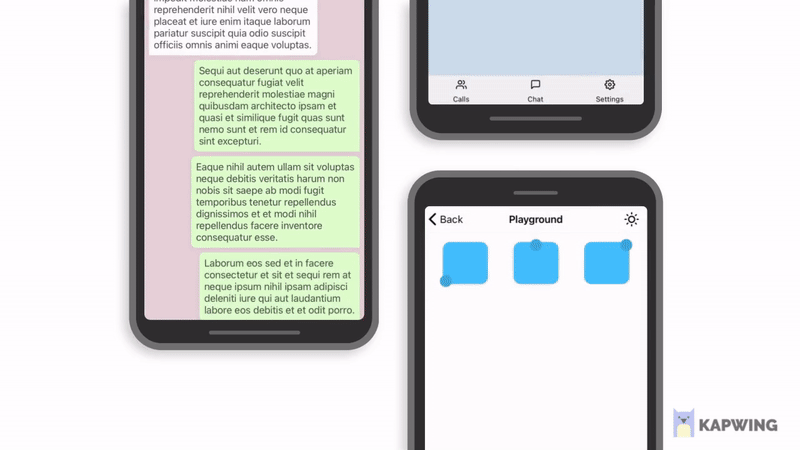

# React Native Hold Menu

   

A performant, easy to use hold to open context menu for React Native powered by Reanimated. 🔥

> This package is experimental and still in progress. Using it in production is not preffered yet.

---

## Features

- Powered with Reanimated v2. 🚀
- Smooth interactions & animations.
- Supports dark/light Mode. 🌚 🌝
- Supports device orientation change.
- Compatible with Expo.
- Written in `TypeScript`.

## Getting Started

Check out [the documentation website](https://enesozturk.github.io/react-native-hold-menu).

---

## Contributors

- [Mo Gorhom](https://gorhom.dev/)

## License

[MIT](./LICENSE)

#### Show Your Support

Please give a star if you like this project! 🤩
